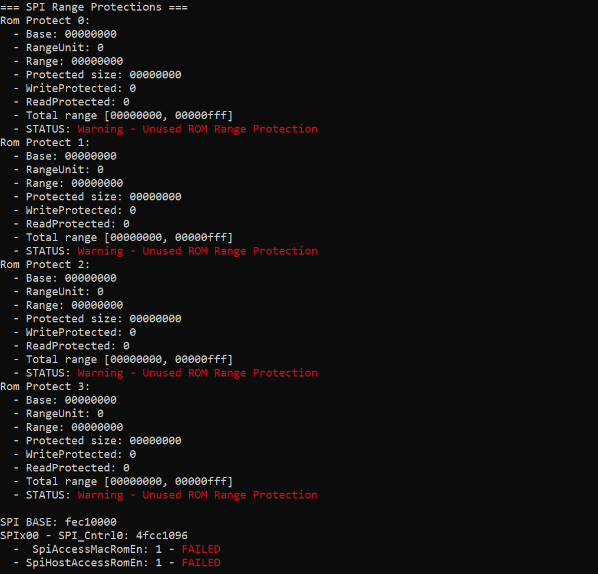
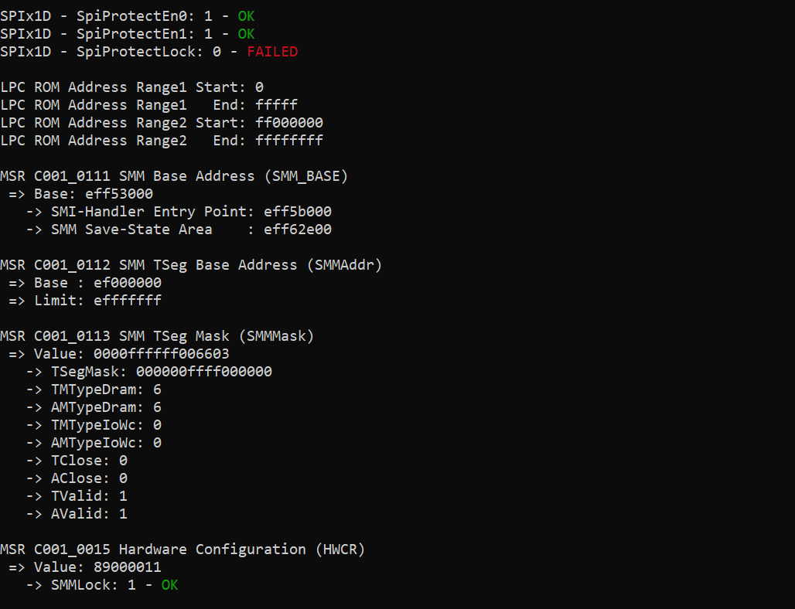

# Platbox
UEFI and SMM Assessment Tool

## Features

Platbox is a tool that helps assessing the security of the platform:

- Dumps the platform registers that are interesting security-wise
    - Flash Locks
    - MMIO and Remapping Locks
    - SMM Base and Locks
    - MSRs
- RW access to the PCI configuration space of devices.
- RW to physical memory and virtual memory.
- Allows allocating physical memory and map memory to usermode.
- Read and Write MSRs.
- Dump SPI Flash content (BIOS) into a file.
- Basic dumb SMI Fuzzer.
- Dump S3 Bootscript (from SMM-Lockbox) into a file.
- Dump EFI Memory Map (Linux only for now).
- List UEFI variables.
- Supports Linux and Windows.
- Supports Intel and AMD.

### Example of 'chipset' command output for an AMD platform




## Project Structure

The project is divided as follows:

- PlatboxDrv: kernel drivers used for Linux and Windows.
- PlatboxLib: the usermode component that loads the kernel driver and provides access to all the previously listed features.
- PlatboxCli: a console client that uses the library.
- Pocs: an example of a program using features from the libary. 


## Compilation Steps

### Windows

```
mkdir build
cd build
cmake -G "Visual Studio 17 2022" -A x64 -S .. -B "build64"
cmake --build build64/ --target platbox_cli
```

#### Release Build

```
cmake -G "Visual Studio 17 2022" -A x64 -S .. -B "build64" 
cmake --build build64/ --target platbox_cli --config Release
```